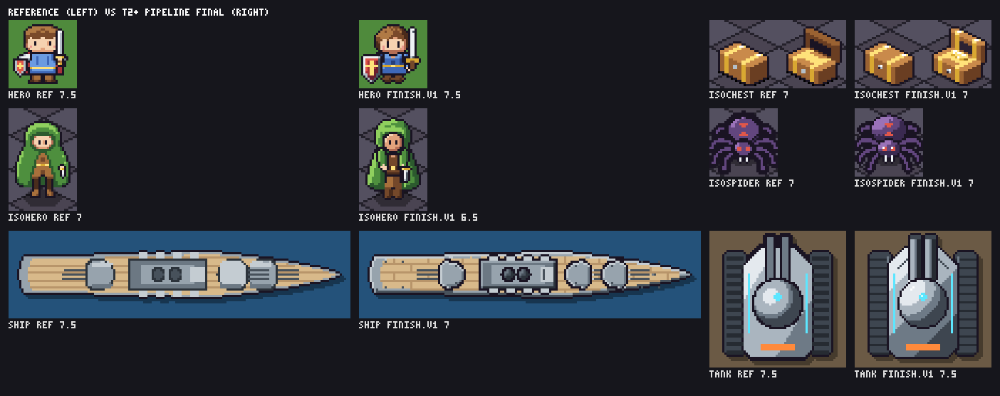

# P1b findings — T2+ parity and the pipeline

Date: 2026-10-06 · Phase: [PLAN P1b](../PLAN.md#p1b--t2-parity-and-the-pipeline-l-2-prs) · Code: `packages/artgen-core/src/t2`,
`src/pipeline.ts`, `packages/artgen-cli` (`asset.ts`, `report.ts`) · Experiment: `packages/artgen-core/bench/pipeline`
· Full per-pass table: [p1b/REPORT.md](p1b/REPORT.md)

**Gate result: 4 of 6 assets reach artlab's best after the finishing pass.** The ship (7 vs 7.5) and the iso hero
(6.5 vs 7) miss by half a point. Per the plan, those two are brought to you with options (below) instead of
starting P2 on top of them silently.

## Outcome against the acceptance criteria

| Criterion | Result |
|---|---|
| Every asset ≥ artlab's best final after finish | **4/6.** hero 7.5/7.5, tank 7.5/7.5, isochest 7/7, isospider 7/7; ship 7/7.5, isohero 6.5/7 |
| Findings note: revisions vs finishing pass | Revisions +0.83 on average (r1 → best base), the finishing pass +0.17 (see below) |
| 8-variant sheets with ≥ 6 distinct designs each | Yes: hero 8, tank 8, ship 8, isochest 8, isospider 7, isohero 7 (`p1b/variants-*.png`) |
| Report per-pass scores and cost, like REPORT-iso.md | [p1b/REPORT.md](p1b/REPORT.md), produced by `npx artgen report` from the ledger |

## How the experiment ran

Each asset was rebuilt from its brief in T2+ only, in artlab's harness style, driven by the new pass state machine:
`artgen pass next` → write `base.vN.js` → `artgen review` (sheet: artlab reference, best-so-far, v(n−1), v(n), in
context) → `artgen score` → … → `finish.v1.js` on the best base (R12) → review → score → `ready`. Every review and
score is a line in `bench/pipeline/ledger.jsonl` (pass id, gate, metrics, code/edit tokens, image tokens, output
hash). Scores are this session's visual review against the artlab final on the same sheet — the same reviewer
caveat as artlab and D11: one agent wrote and scored, so the side-by-side sheets are the evidence, not the numbers.

| Asset | Target | r1 | r2 | r3 | Finish (on) | Met |
|---|---|---|---|---|---|---|
| hero 32×32 | 7.5 | 5.5 | 6.5 | 7 | 7.5 (v3) | yes |
| tank 64×64 | 7.5 | 6.5 | **7.5** | 7 | 7.5 (v2) | yes |
| ship 160×41 | 7.5 | 6 | 6.5 | 7 | 7 (v3) | no |
| isochest 64×32 | 7 | 6.5 | **7** | 6.5 | 7 (v2) | yes |
| isospider 32×32 | 7 | **6.5** | 6 | 6 | 7 (v1) | yes |
| isohero 32×48 | 7 | 5.5 | 6 | 6.5 | 6.5 (v3) | no |

Cost at artlab's price basis: $0.32 for all six (11.5k output, 23.4k review-image tokens), $0.04–0.07 per
asset. artlab spent $0.044–0.077 per *technique* for three assets, so the fixed pipeline costs roughly 2–3× per asset,
mostly review images (≈ 4 sheets per asset, each larger than artlab's because they carry reference + best + v(n−1)).

## Where the quality came from
- **Revisions carry most of it.** r1 → best base: hero +1.5, tank/ship/isohero +1, isochest +0.5, isospider 0.
  First builds were already 5.5–6.5 (artlab's T2 first builds on the iso set: 4–6.5).
- **R12 mattered in half the assets.** tank v3, isochest v3 and isospider v2/v3 regressed while adding detail or
  params; the state machine sent the next revision and the finish to the best version, not the latest.
- **The finishing pass added +0.5 where a pixel-level problem was left** (hero: hair fringe and face tone as
  char-map patches; isospider: leg line weight) and ~0 where the base was already clean (tank, chest, ship). It
  did not rescue a weak form: the ship's turret shapes and the iso hero's proportions are base problems.
- **3D mode** reached the chest's 7 on v2 with a 27-line module; open/closed are one model, plus 8 variants.
- **Variants** come cheaply once params exist (swaps, toggles, choices); the schema is 5–8 lines per asset.

## The two misses
| Asset | Gap to the artlab final | Kind |
|---|---|---|
| ship (7 vs 7.5) | turret housings read as round blobs (artlab: flat-faced, lighter roofs, gun stripes); the bridge window line reads as a glyph | authoring of the base; no missing primitive (`path` + `bevel` can draw them) |
| isohero (6.5 vs 7) | narrower, less charming figure than the hand-placed T1 map; cloak panels shade blotchy with `normal` on thin shapes | authoring + a shading weakness: `normal` on long thin shapes gives uneven bands |

Options (PLAN P1b escalation):
1. **Accept** — both are within half a point, all six pass the conformance gate, and both gaps are authoring.
2. **Close the gap** (one extra PR) — a `ramp`/`band` override per part for thin shapes (or a `normal` mode that
   rounds across the short axis only), then re-run the ship and iso hero through r1–r3 + finish.
3. **Allow a U-stage round** for these two — the pipeline's user-feedback iteration (`base.v4` → re-finish) is
   built; it is the path a real project would take.

## Engine changes found by the experiment (stage bugs, E9)
- **Underlays doubled the silhouette** (dark ring + outer line = 2 px). Underlays now ink only over content already
  drawn beneath them; the outer line owns the silhouette.
- **Slabs filled their whole region** in 3D mode (the chest's straps became walls). A slab now recolours the
  surface it lies on; `add: true` fills for raised trim.
- **`fix.jaggies` removed neighbouring elbows in one batch**, which can break a stair into gaps; it now decides in
  scan order against the pixels already changed.
- **Patch snapshots stored hex colours**, so any restyle would have marked every finish stale. They store tokens.
- Added during the run: `linear` shading (hull gradients — the tank's v1 → v2 jump), `px.light.tone`,
  `px.outline.weight`, scene lint in conformance (R4/R11 fail, R5 and empty shapes flag).
- Performance: windowing the distance transforms to each shape's bounds took the 64×64 ss=8 tank from 250 ms to
  ~110 ms (SPEC §15 target < 200 ms); renders are pixel-identical before and after (all 24 scored hashes hold).

## Notes for P2
- Style tiles use the short pipeline (1 revision + finish). The data says r1 alone is ~1 point under the best
  base, so tiles will understate a direction by about that much; label them as drafts.
- `normal` on thin parts and `bevel` on tubes (isospider v3: 14 % orphans) are the two shading choices that went
  wrong repeatedly; the `artgen` skill should steer thin parts to `flat`/`cyl` and keep `normal` for masses.
- Group underlays don't separate siblings (isospider v2): give each limb its own underlay. Mirrored copies get
  their own underlays, so a mirrored hood gets an ink seam on the axis (isohero v2): draw symmetric masses once.
- Review sheets with reference + best + previous rows cost 300–1600 image tokens; P3's budget should count ~4
  reviews per asset.
